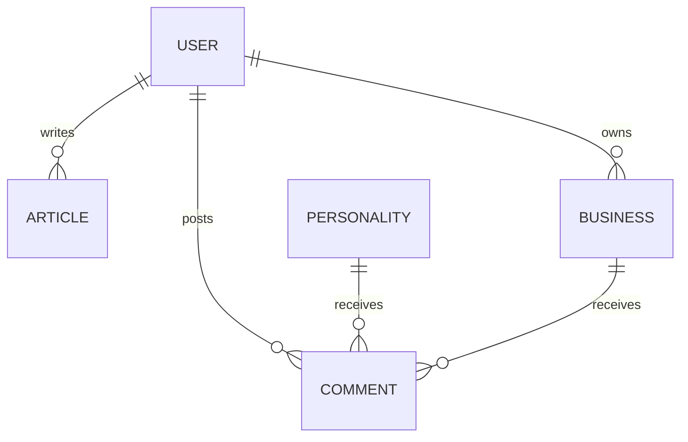

# Volume 5 – Database & Architecture

## 1. Mongoose Collections & Schema Architecture
We define five primary collections:
1.  **Users / Sessions / Accounts**: Built to match Auth.js Adapter schema standard.
2.  **Personalities**:
    *   `name`: String (Indexed)
    *   `slug`: String (Unique, URL safe)
    *   `category`: String (e.g., 'Science', 'Sports')
    *   `biography`: String
    *   `birthDate`: Date
    *   `deathDate`: Date (Optional)
    *   `achievements`: Array of Objects
    *   `images`: Array of Strings (Cloudinary URLs)
3.  **Businesses**:
    *   `name`: String
    *   `slug`: String (Unique)
    *   `category`: String
    *   `location`: Point (2dsphere index for geolocation searches)
    *   `ownerId`: ObjectId -> User
4.  **Articles**:
    *   `title`: String
    *   `content`: String
    *   `authorId`: ObjectId -> User
    *   `tags`: Array of Strings
5.  **Comments**:
    *   `targetId`: ObjectId (Polymorphic: Personalities or Businesses)
    *   `userId`: ObjectId -> User
    *   `body`: String

## 2. ER Diagram

## 3. Database Indexing & Caching Strategy
*   **Indexes**:
    *   `personalities.slug`: Unique index
    *   `businesses.location`: `2dsphere` index for nearby-business lookup APIs.
    *   `articles.title`: Text search index.
*   **Caching**: MongoDB read queries are cached where appropriate to reduce Atlas DB costs.
